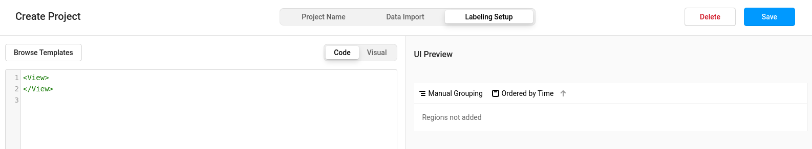
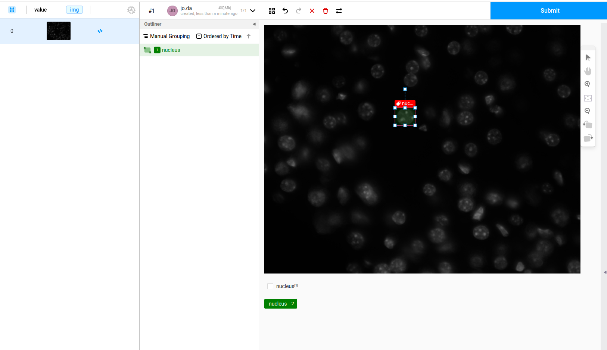
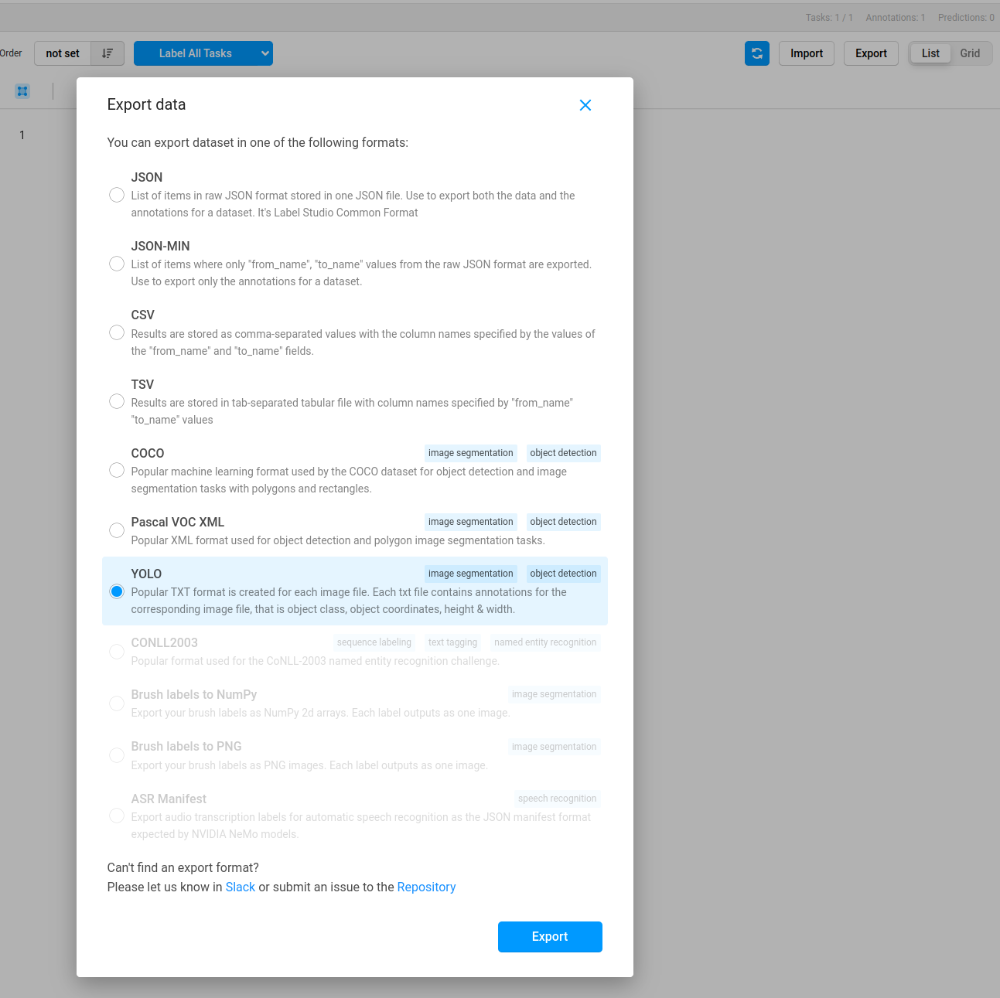

# imagec-ai-training

Package to train object detection model for biological problems

## Start

1) Install Visual Studio Code and the remote container plugin
2) Open the folder
3) Reopen project in container


## Create training data

1) Execute `create-new-project.sh`
2) Execute `start-label-studio.sh` from a separate terminal.
3) Open a browser and type `http://127.0.0.1:8080`
4) Use any e-mail and password to login
5) Create new project
6) Go to **Labeling Setup** and click custom template

7) Copy paste the content form `templates/labeling_interface.xml`.
8) Click **Save**.
9) Click **Import** to import new images for training
10) Open the image and label them

11) When you have finished export the data in YOLO format

12) Unzip the downloaded folder and split the data in train and valid.
13) Copy the images and labels to the folders `train/images` and `train/labels` and `valid/images` and `valid/labels` 


## Start the training

1) Go to `projects/<PROJECT NAME>/data.yaml` and enter the labels of your training data.
2) Execute `start-training.sh`or  `start-seg-training.sh`


# Faster training with GPU

## Install NVIDIA container toolkit

```sh
distribution=$(. /etc/os-release;echo $ID$VERSION_ID) \
      && curl -fsSL https://nvidia.github.io/libnvidia-container/gpgkey | sudo gpg --dearmor -o /usr/share/keyrings/nvidia-container-toolkit-keyring.gpg \
      && curl -s -L https://nvidia.github.io/libnvidia-container/$distribution/libnvidia-container.list | \
            sed 's#deb https://#deb [signed-by=/usr/share/keyrings/nvidia-container-toolkit-keyring.gpg] https://#g' | \
            sudo tee /etc/apt/sources.list.d/nvidia-container-toolkit.list

sudo apt-get update
sudo apt-get install -y nvidia-container-toolkit
sudo nvidia-ctk runtime configure --runtime=docker
sudo systemctl restart docker
```

- When starting the docker container add `--gpus=all` argument
- Add the argument `--device 0` to the `start-training.sh` and `start-seg-training.sh`

Use `nvtop` to show gpu usage

# Todos

- [ ] `https://ultralytics.com/assets/Arial.ttf to /root/.config/Ultralytics/Arial.ttf`

---
*References*  

https://blog.paperspace.com/train-yolov5-custom-data/  
https://github.com/ultralytics/yolov5/issues/475


## Metrics


Klassenbezogene Metriken
Einer der Abschnitte der Ausgabe ist die klassenweise Aufschlüsselung der Leistungsmetriken. Diese detaillierten Informationen sind nützlich, wenn du herausfinden willst, wie gut das Modell für jede einzelne Klasse abschneidet, vor allem in Datensätzen mit einer Vielzahl von Objektkategorien. Für jede Klasse im Datensatz wird Folgendes angegeben:

Klasse: Dies bezeichnet den Namen der Objektklasse, z. B. "Person", "Auto" oder "Hund".

Bilder: Diese Metrik zeigt dir die Anzahl der Bilder im Validierungsset, die die Objektklasse enthalten.

Instanzen: Hier wird gezählt, wie oft die Klasse in allen Bildern des Validierungssatzes vorkommt.

Box(P, R, mAP50, mAP50-95): Diese Metrik gibt Aufschluss über die Leistung des Modells bei der Erkennung von Objekten:

P (Präzision): Die Genauigkeit der erkannten Objekte, die angibt, wie viele Erkennungen richtig waren.

R (Recall): Die Fähigkeit des Modells, alle Instanzen von Objekten in den Bildern zu identifizieren.

mAP50: Mittlere durchschnittliche Genauigkeit, berechnet bei einem Schwellenwert von 0,50 für die Überschneidung über die Vereinigung (IoU). Er ist ein Maß für die Genauigkeit des Modells, das nur die "einfachen" Erkennungen berücksichtigt.

mAP50-95: Der Durchschnitt der durchschnittlichen Genauigkeit, die bei verschiedenen IoU-Schwellenwerten zwischen 0,50 und 0,95 berechnet wurde. Er gibt einen umfassenden Überblick über die Leistung des Modells bei verschiedenen Schwierigkeitsgraden.


https://docs.ultralytics.com/de/guides/yolo-performance-metrics/#how-to-calculate-metrics-for-yolov8-model